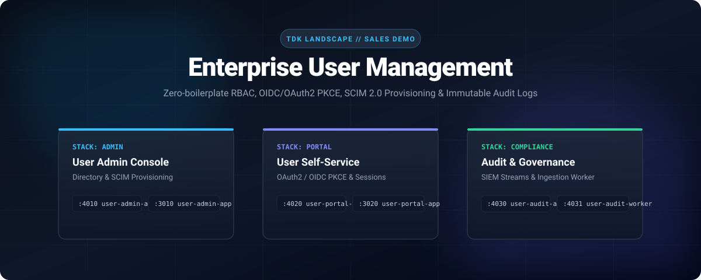
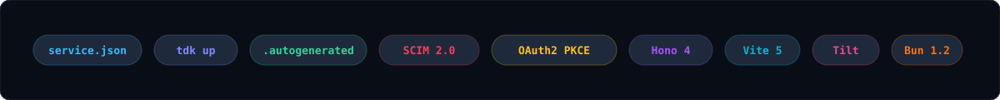
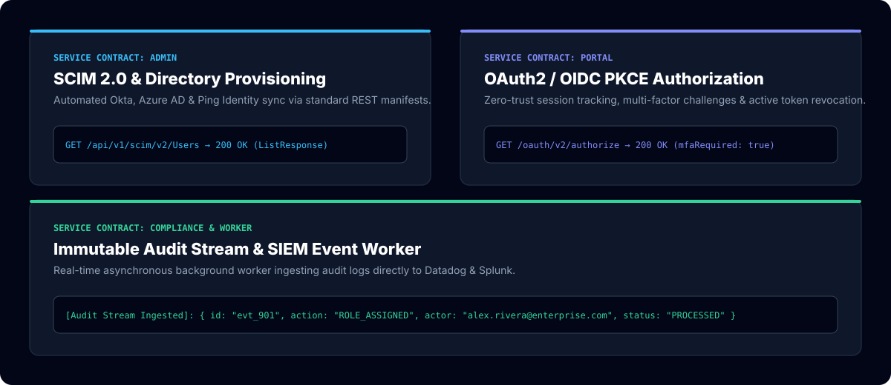
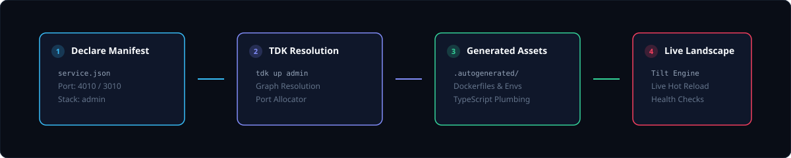

<!-- markdownlint-disable MD013 MD033 MD041 -->

<p align="center">
  
</p>

<p align="center">
  <a href="#run-it">Run it</a>
  &nbsp;&nbsp;/&nbsp;&nbsp;
  <a href="#the-landscape">Explore the landscape</a>
  &nbsp;&nbsp;/&nbsp;&nbsp;
  <a href="#generation">Understand generation</a>
  &nbsp;&nbsp;/&nbsp;&nbsp;
  <a href="#sales-pitch-deck">Sales Pitch Deck</a>
  &nbsp;&nbsp;/&nbsp;&nbsp;
  <a href="#demo-walkthrough">Demo Walkthrough</a>
  &nbsp;&nbsp;/&nbsp;&nbsp;
  <a href="https://github.com/tdk-landscape/tdk-cli">TDK CLI</a>
</p>

<br>

## Enterprise User Management in Seconds

This repository is a production-grade demonstration of the TDK **Project-Stack-Resource (PSR)** model engineered specifically for **Enterprise Identity, SCIM 2.0 Provisioning, OAuth2/OIDC PKCE, and Immutable Compliance Auditing**.

You declare your identity and governance services in simple `service.json` manifests. TDK automatically discovers the landscape, resolves cross-stack dependencies, allocates dynamic port bindings (`:4010`, `:4020`, `:4030`), and generates local Docker, Vite, environment variables, and TypeScript plumbing inside `.autogenerated/`.

<p align="center">
  
</p>

---

## Run It

### Prerequisites

- [Docker](https://docs.docker.com/get-docker/) is running.
- [Tilt](https://docs.tilt.dev/install.html) is installed.
- [Bun 1.2+](https://bun.sh/docs/installation) is installed.
- [TDK CLI](https://github.com/tdk-landscape/tdk-cli#installation) is available as `tdk`.

```bash
git clone https://github.com/tdk-landscape/tdk-user-management.git
cd tdk-user-management

# Spin up the entire Enterprise User Management landscape
tdk up
```

TDK discovers all 3 stacks and their 6 underlying resources, allocates non-conflicting ports, and starts the containerized execution graph.

```bash
# Start a specific domain stack (e.g. Admin or Portal or Compliance)
tdk up admin
tdk up portal
tdk up compliance

# Inspect all running identity services
tdk status

# Stop the entire landscape cleanly
tdk down
```

---

## The Landscape

<p align="center">
  
</p>

| Stack | Resource | Type | Runtime | Port | Dependencies | Primary Capability |
| --- | --- | --- | --- | ---: | --- | --- |
| **admin** | [`user-admin-api`](services/admin/user-admin-api) | Backend API | Hono 4 / Bun | [`4010`](http://localhost:4010/health) | None | Directory & SCIM 2.0 REST endpoints |
| **admin** | [`user-admin-app`](services/admin/user-admin-app) | Frontend App | Vite 5 / React | [`3010`](http://localhost:3010) | `user-admin-api` | Enterprise RBAC Directory Console |
| **portal** | [`user-portal-api`](services/portal/user-portal-api) | Backend API | Hono 4 / Bun | [`4020`](http://localhost:4020/health) | None | OAuth2 / OIDC PKCE & Session Tokens |
| **portal** | [`user-portal-app`](services/portal/user-portal-app) | Frontend App | Vite 5 / React | [`3020`](http://localhost:3020) | `user-portal-api` | End-User Self-Service Portal |
| **compliance** | [`user-audit-api`](services/compliance/user-audit-api) | Backend API | Hono 4 / Bun | [`4030`](http://localhost:4030/health) | None | Immutable Event Logs Query Engine |
| **compliance** | [`user-audit-worker`](services/compliance/user-audit-worker) | Background Worker | Bun Worker | [`4031`](http://localhost:4031/health) | `user-audit-api` | Asynchronous SIEM Stream Ingestion |

```text
tdk-user-management/
├── Tiltfile
├── TILT_SERVICE_DEFAULTS.star
├── TILT_TECH_STACK.star
├── SALES_PITCH.md
├── DEMO_GUIDE.md
├── docs/
│   ├── readme-hero.svg
│   ├── readme-marquee.svg
│   ├── readme-bento.svg
│   └── readme-flow.svg
└── services/
    ├── admin/
    │   ├── user-admin-api/
    │   │   ├── service.json
    │   │   ├── .autogenerated/
    │   │   └── src/index.ts
    │   └── user-admin-app/
    ├── portal/
    │   ├── user-portal-api/
    │   └── user-portal-app/
    └── compliance/
        ├── user-audit-api/
        └── user-audit-worker/
```

---

## Generation

<p align="center">
  
</p>

Every identity resource owns a compact, declarative [`service.json`](services/admin/user-admin-api/service.json):

```json
{
  "appName": "user-admin-api",
  "appType": "backend",
  "stack": "admin",
  "port": 4010,
  "dependencies": [],
  "healthCheck": {
    "enabled": true,
    "path": "/health"
  }
}
```

Running `tdk up` turns that manifest into the exact plumbing required by Tilt, Docker, Vite, and Bun.

> [!IMPORTANT]
> Edit `service.json`, `TILT_SERVICE_DEFAULTS.star`, or `TILT_TECH_STACK.star`. Never edit `.autogenerated/` directly; TDK regenerates its contents on every pass.

---

## Project, Stack, Resource (PSR Model)

| Level | Meaning in TDK User Management | Command Surface |
| --- | --- | --- |
| **Project** | The entire enterprise security landscape (`tdk-user-management`) | `tdk up`, `tdk down`, `tdk status` |
| **Stack** | Independent business domain (`admin`, `portal`, `compliance`) | `tdk up admin`, `tdk up portal` |
| **Resource** | Micro-runnable API, web console, or worker process | `tdk resource <name> ...` |

---

## Sales Pitch Deck & Demo Guide

This repository is tailored for client presentations, enterprise sales pitches, and architectural reviews:

- 📊 **[Sales Pitch Deck (SALES_PITCH.md)](SALES_PITCH.md):** Executive problem statement, core value pillars, and ROI metrics.
- 🎬 **[Demo Walkthrough Guide (DEMO_GUIDE.md)](DEMO_GUIDE.md):** Step-by-step 3-minute live presentation playbook for sales engineers.

---

## Testing Individual Resources

Each micro-resource is fully typed, standalone, and testable:

```bash
cd services/admin/user-admin-api
bun install
bun test
bun run typecheck
```

---

<p align="center">
  <strong>Declare the manifests. Generate the landscape. Accelerate enterprise identity delivery.</strong>
</p>

<p align="center">
  <a href="https://github.com/tdk-landscape">TDK Landscape</a>
  &nbsp;&nbsp;/&nbsp;&nbsp;
  <a href="https://github.com/tdk-landscape/tdk-cli">CLI</a>
  &nbsp;&nbsp;/&nbsp;&nbsp;
  <a href="SALES_PITCH.md">Sales Pitch</a>
  &nbsp;&nbsp;/&nbsp;&nbsp;
  <a href="DEMO_GUIDE.md">Demo Guide</a>
  &nbsp;&nbsp;/&nbsp;&nbsp;
  MIT License
</p>
